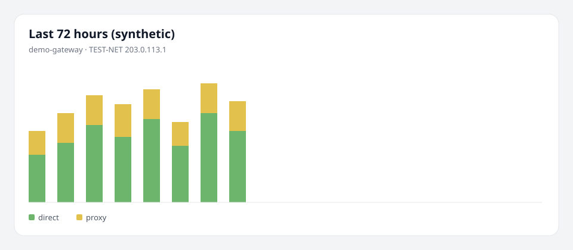

# LanTally

[English](README.md) | **简体中文**

LanTally 是给家庭和小型网络用的**自托管流量账本**：在网关或本机放一个很轻的上报程序，把用量记下来，区分直连和走代理，再按出口倍率估账单。

它只观察、记账、对账，**不改你的网络、不限速、不远程执行命令**。

> v0.1.0 · https://github.com/misakayyds/lantally · 镜像 `ghcr.io/misakayyds/lantally`

## 三步上手

**1. 跑一个容器**

```bash
docker run -d --name lantally -p 8080:8080 -v lantally:/var/lib/lantally ghcr.io/misakayyds/lantally:v0.1.0
```

本仓库：`docker compose -f deploy/docker/compose.yaml up --build`

只想看图、不接真网关时加上合成数据（TEST-NET，不是你家的流量）：

```bash
docker run -d --name lantally -p 8080:8080 -e LANTALLY_DEMO=1 -v lantally:/var/lib/lantally ghcr.io/misakayyds/lantally:v0.1.0
```

**2. 打开** `http://<主机>:8080`，按向导设置管理员密码。

**3. 点「添加节点」**，把页面给的一条命令在网关或本机执行。页面会从「等待上报」变成「已收到第一包」。



安装脚本可能只读本机 Mihomo/OpenClash 配置，密钥不会上传。公网必须放在 HTTPS 反代后面。

若 GHCR 上还没有 tag，先本地 compose 构建；打 `v0.1.0` 并 push tag 后，Release 流水线会推镜像和多架构 agent。

## 你能看到什么

- 按设备 / 节点的总量、直连、代理，以及倍率折算
- 24h / 72h / 7d / 30d 图（明细 14 天，日聚合永久）
- 节点静默、重置、突增、对账偏差超过 10% 的告警
- 一次性领取码，不用复制长 token

## v0.1 明确不会

- 远程命令、限速、改防火墙或代理策略
- 记录域名、网址、完整目的地址
- 在服务商不公开规则时保证和账单分毫不差

## 从 Release 装 agent

GitHub Release 带校验和、SPDX SBOM，以及 linux/amd64+arm64+armv7+mips/mipsle（softfloat）、darwin、windows/amd64 的 agent。容器里同样托管这些二进制。

## 文档

- 运维（升级、备份、HTTPS）：[`docs/operations.md`](docs/operations.md)
- 7 天对账记录（待发布者自测填入）：[`docs/reconciliation-v0.1.md`](docs/reconciliation-v0.1.md)
- 设计与 ADR：英文 README 的 Docs 一节

## 许可证

[Apache License 2.0](LICENSE)
