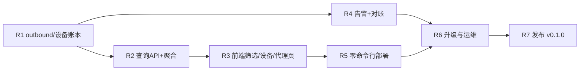

# LanTally 首个可发布版本（v0.1.0）规划

> 状态：R1–R7 已落地。打 `v0.1.0` tag 后由 GitHub Actions 发 Release 与 GHCR。
> 前置：M1–M9 已在 `main` 落地（注册、摄入、身份、账本、Mihomo 采集、嵌入式 UI、72 小时堆叠图、all-in-one 打包）。
> 本文接替原计划的 M10，展开为 R1–R7。执行时逐个里程碑拆 TDD 步骤。

## 一、什么叫「可以真正发布」

一个普通用户（不看源码、不开终端调试）能完成下面这条路径，才算可发布：

1. 在 NAS 或任何 Docker 主机上，用**一条 docker 命令或一份 compose 文件**把服务跑起来。
2. 打开网页，首次进入即引导设置管理员密码。
3. 在网页上点「添加节点」，照着页面给出的**单条安装命令**在网关上执行一次，agent 即装好、自启、开始上报。
4. 网页上能按**设备、节点、时间范围**看流量；代理页能看到**每个出口节点**用了多少、倍率折算后是多少。
5. 节点掉线、流量异常时页面有告警提示。
6. 升级 = 换镜像重启，数据自动迁移；agent 不需要每次跟着升级。

以上任何一步需要用户手写 JSON、手拷 token 文件、手配 procd 脚本，都不算达标。

**单设备用户同样是目标受众。** 如果用户只有一台笔记本跑 Clash/Mihomo、没有独立网关，agent 装在本机即可——「节点 = 本机」。iface 读本机网卡得到总量，Mihomo 读本机 dashboard 得到 direct/proxy 拆分。server 甚至可以和 agent 跑在同一台机器上（Docker 跑 server，agent 跑在宿主机读本机 Mihomo）。部署向导必须覆盖这条路径，不能默认用户有网关。

## 二、现状盘点（2026-08-19）

| 能力 | 状态 |
| --- | --- |
| 节点注册 / token / 撤销 | 后端有，UI 只有注册；撤销无入口 |
| 摄入去重 / 断点重试 / 缺口记录 | 完成 |
| iface / nlbwmon / Mihomo 采集 | iface、Mihomo 已接 agent；nlbwmon 已接 agent，`collectors.nlbwmon` 默认关 |
| 账本（total/direct/proxy_*） | 完成，含 30 分钟粒度 `ledger_samples` 和 `outbound` 列 |
| 72 小时堆叠图 | 完成（概览按节点、代理页按类别） |
| 按设备记账 | Mihomo 对局域网 `sourceIP` 产出设备增量；无 sourceIP 时保持节点级。nlbwmon 开启后提供按设备总量 |
| 按出口节点（outbound）记账 | **R1 已完成**。`proxy_*` 按 outbound 分列存储，求和等于该类总量 |
| 倍率折算 | **R3 已完成**。`outbound_multipliers` 表；ingest 入账时加载；历史不回溯。未配置出口仍记 `proxy_unadjusted` |
| 时间筛选 / 设备筛选 | **R2+R3 已完成**。API 见 R2；UI 共用 24h/72h/7d/30d 与分组工具条 |
| 日 / 月历史 | **R2 已完成**。`ledger_daily` 每小时汇总，samples 保留 14 天；30d 查询走 daily |
| 告警 | **R4 已完成**。静默 / 突增 / 重置 / 对账偏差写入 SQLite；告警页可确认，确认后同一事件不重复提示 |
| 对账 | **R4 已完成**。代理页本月账单对照：重置日 + 服务商用量 vs 本地 `proxy_adjusted`，差率超 10% 告警 |
| 部署 | **R5 已完成**。首次向导设密码；一次性领取码 + `/install.sh` `/install.ps1`；镜像内托管各 os/arch agent；节点页显示最后上报并可撤销/重发 |
| 发布工件 | 无版本号、无 Release、无镜像仓库、无 ipk |

## 三、里程碑

### R1 — 按出口节点与按设备的账本（后端地基）

状态：已实现（分支 `feat/r1-outbound-device-ledgers`）。

前端筛选和代理页节点显示都依赖这一步，必须最先做。

- 协议 `ProxyDelta.ByOutbound` 已携带 outbound 名，但入账时被合并。新增账本维度：
  - `ledger_samples` / `ledger_totals` 增加 `outbound` 列（空串表示不区分），迁移号顺延。
  - 记账规则不变：outbound 细分只作用于 `proxy_raw` / `proxy_adjusted` / `proxy_unadjusted`，绝不参与 `total` 的来源选择，不与 nlbwmon 相加。
- Mihomo 采集器解析 `metadata.sourceIP`，产出 per-device 的代理字节（`SourceMihomo` 设备增量已有入账路径）；sourceIP 只在局域网内使用，不作为指标 label 导出。
- nlbwmon 采集器接入 agent 主路径（配置 `collectors.nlbwmon`，默认关），有 nlbwmon 的网关自动获得按设备总量。
- 设备身份补全：Mihomo 观察到的 IP 走现有 identity 解析，与 neigh/nlbwmon 证据合并。
- **验收**：单元测试覆盖「同一批次同时含 nlbwmon 与 Mihomo 时不双计」「outbound 细分求和等于 proxy_raw 总量」「sourceIP 缺失时回退为节点级代理字节」。

### R2 — 查询 API 与时间/设备筛选

状态：已实现（分支 `feat/r2-traffic-query`）。

- 新增 `GET /v1/traffic`，参数：`from`、`to`、`bucket`、`group`（node/device/outbound/class）、`node`、`device`、`class`。现有三页内嵌的 traffic 字段改为调用同一查询层。
- 时间范围预设：24h / 72h / 7d / 30d / 自定义；桶宽自动匹配（≤72h 用 30 分钟，7d 用 2 小时，30d 用 1 天）。
- 日聚合表 `ledger_daily`（按天 × 节点 × 设备 × 类别 × outbound），由 server 定时从 samples 汇总；samples 默认保留 14 天，daily 永久保留。月视图由 daily 现算。
- **验收**：7d/30d 查询走 daily 表；samples 清理后历史曲线不变；重复汇总幂等。

### R3 — 前端：筛选、设备页、代理页节点

状态：已实现（分支 `feat/r3-ui-filters`）。

- 图表工具条：时间范围切换 + 分组切换（按节点 / 按设备 / 按类别 / 按出口），所有页面共用一套组件。
- 设备页：设备列表（名称、IP/MAC 摘要、总量、直连、代理）→ 点进单设备页：该设备的时间曲线 + 直连/代理拆分；支持给设备改备注名、手动合并/拆分（`PUT /v1/devices/{id}`、`POST .../merge`、`POST .../unmerge`）。
- 代理页：
  - 按 outbound 堆叠的时间图（图例即节点名，样式沿用现有 72h 图）。
  - outbound 表：节点名、原始用量、倍率、折算用量、占比；未配置倍率的行明确标注「未折算」。
  - 倍率编辑：直接在表格行内填写倍率（如 `x1.5`），保存进 `outbound_multipliers`，后续入账即时生效；历史不回溯重算（在 UI 注明）。
- 概览页：保留现状 + 顶部时间范围联动。
- **验收**：无数据、单节点、多节点三种状态截图检查；筛选组合不出现空白崩溃；移动端单列可用。

### R4 — 告警与对账（把「账本可信」闭环）

状态：已实现（分支 `feat/r4-alerts-reconciliation`）。

- 接线现有评估器：节点静默（超过 3 个上报间隔无批次）、计数器重置频繁、用量突增。告警落 SQLite，告警页展示 + 确认（acknowledge）。
- 对账：代理页增加「本月账单对照」——用户手填服务商侧的已用量与重置日，页面显示本地折算用量、差值与差率；偏差超 10% 产生告警。
- **验收**：模拟节点停报触发静默告警；填入对账数字后差率计算正确；告警确认后不再重复提示。

### R5 — 零命令行部署（本次发布的核心体验）

状态：已实现（分支 `feat/r5-zero-cli-deploy`）。GHCR 推送仍属 R7；文档与 compose 使用镜像名 `ghcr.io/misakayyds/lantally:latest`，本地可 `--build`。

服务端：

- 镜像发布到 GHCR（`ghcr.io/misakayyds/lantally`），`linux/amd64` + `linux/arm64`。
- 文档只给一条命令：`docker run -d -p 8080:8080 -v lantally:/var/lib/lantally ghcr.io/misakayyds/lantally:latest`，以及等价 compose 文件。
- 首次打开网页进入初始化向导：设置管理员密码（替代「去容器日志里找密码」的流程；env 注入方式保留给自动化）。

Agent（关键设计——**一次性领取码**，避免复制长 token）：

- server 增加「安装包端点」：托管各架构 agent 静态二进制与安装脚本，均带校验和。
- UI「添加节点」向导：
  1. 填节点名 → 生成**一次性领取码**（短、有效期 10 分钟、只能兑换一次）。
  2. 页面按所选平台给出**单条命令**：
     - **OpenWrt / 通用 Linux：** `sh -c "$(wget -qO- http://<server>:8080/install.sh)" -- <领取码>`
     - **macOS：** `curl -fsSL http://<server>:8080/install.sh | sh -s -- <领取码>`（launchd 自启）
     - **Windows：** PowerShell 一行下载 + 注册为服务（或托盘常驻），`irm http://<server>:8080/install.ps1 | iex`，交互式填入领取码。
  3. 脚本自动：探测架构 → 下载二进制 → 用领取码向 server 换取正式 token（换取后领取码作废）→ 写配置与 token 文件（0600）→ 注册 procd/systemd/launchd/Windows 服务并启动。
  4. 页面轮询显示「等待上报… → 已收到第一包 ✓」，用户不用看任何日志。
- Mihomo 自动接线：安装脚本只读探测本机 OpenClash/Mihomo 控制端口与 secret（从本地配置读取，绝不上传 server），探测到即自动启用 `collectors.mihomo`；探测不到则静默跳过，UI 节点详情里可看到「未检测到 Mihomo」。
- **单设备 / 本机模式：** 安装向导提供「本机即节点」选项——server 和 agent 在同一台机器上时，向导提示 Mihomo 地址默认填 `127.0.0.1:9090`；如果用户本机没有 Mihomo，agent 仅采集 iface（记总量，无 direct/proxy 拆分），在 UI 明确标注「此节点未接入代理采集」。
- 节点详情页：最后上报时间、agent 版本、启用的采集器、操作系统与架构、token 撤销与重发（重发走同一领取码流程）。
- **验收**：在干净的 OpenWrt（amd64/arm64）、Debian、macOS 和 Windows 上，从点「添加节点」到图表出现柱子 ≤ 3 分钟，全程不手编任何文件。单设备场景单独验收一次（server + agent 同机）。

### R6 — 升级、备份与运维兜底

状态：已实现（分支 `feat/r6-upgrade-ops`）。

- 迁移前自动备份 SQLite（机制已有），升级失败自动回滚说明写入 operations 文档。
- UI 设置页：修改管理员密码、下载 SQLite 备份、查看数据保留策略。
- agent 与 server 的协议版本协商：server 拒绝未知 `protocol_version` 时返回明确错误；旧 agent 对新 server 保持可用（v0.1 内协议冻结）。
- 会话安全收尾：登录失败限速、会话过期刷新、Cookie `Secure` 随 HTTPS 自适应；文档明确「公网暴露必须置于 HTTPS 反代之后」。
- **验收**：从上一个 tag 的数据卷启动新版本，迁移成功且图表历史完整；回滚步骤按文档演练一次。

### R7 — 发布工程

状态：已实现（分支 `feat/r7-release`）。真正的 GitHub Release / GHCR 推送在打 `v0.1.0` tag 后由 Actions 执行。7 天真机对账记录见 `docs/reconciliation-v0.1.md`（待发布者自测填入，仓库内不虚构现场数字）。

- 语义化版本 `v0.1.0`；GitHub Actions：test → 多架构构建（linux/amd64、arm64、mips/mipsle softfloat、darwin/amd64+arm64、windows/amd64）→ 校验和 + SBOM → GitHub Release + GHCR 推送。
- README（中英）重写为「三步上手」：跑容器 → 设密码 → 加节点；截图用合成数据。
- 真实网关 7 天对账（发布者自测，结果脱敏后记入 docs）：本地折算用量 vs 服务商计数偏差 ≤ 与既定阈值。
- **验收**：一台从未接触过项目的机器，仅凭 README 完成部署并出图。

## 四、用户没点名、但发布前必须补的事（汇总）

1. **倍率配置 UI 与生效语义**（R3）——没有它「折算用量」永远等于原始值，对账无意义。
2. **数据保留与日聚合**（R2）——samples 每 15 秒一批增长，不做 rollup 几个月后 SQLite 会失控。
3. **告警接线**（R4）——路线图承诺项，页面现在是空壳。
4. **设备重命名 / 合并入口**（R3)——后端能力已有，无 UI 等于没有。
5. **一次性领取码注册**（R5）——避免「token 只显示一次、用户复制丢失」这一最大部署挫败点。
6. **首次运行向导**（R5）——替代「去容器日志找初始密码」。
7. **节点健康可视化**（R5）——最后上报时间、agent 版本，排障不进终端。
8. **登录安全与 HTTPS 指引**（R6）——发布到公网仓库后一定会有人直接暴露公网。
9. **协议冻结与升级兼容**（R6）——agent 装在网关上，不能要求随 server 每版更新。
10. **多架构 + mips 构建**（R7）——大量存量 OpenWrt 路由是 mips。
11. **合成数据演示模式**（可选，R7）——`--demo` 用 sim 采集器出一套假数据，README 截图与新用户预览共用。
12. **macOS / Windows agent 构建与安装脚本**（R5/R7）——单设备用户可能只有一台笔记本，没有网关。
13. **server + agent 同机部署指引**（R5）——单设备用户的 server 和 agent 在同一台机器上，向导需要照顾这条路径，不能假设 agent 一定装在远端网关。

## 五、明确不做（维持 v0.1 边界）

- 不做限速、封禁、策略下发；不改网关任何配置（Mihomo 探测为只读）。
- 不采集域名 / URL / 目的地址。
- 不做多用户 / 权限体系（单管理员）。
- 不做 agent 自动升级。
- 不引入前端框架重写；现有内嵌静态页继续演进（React 迁移推迟到 v0.2 再评估）。

## 六、顺序与依赖

R1→R2→R3 是主线；R4 可与 R3 并行；R5 依赖 R3（向导页面）；R7 收尾。

## 七、风险

- `ledger_samples` 加 `outbound` 列会放大行数（节点 × 类别 × outbound），R2 的保留策略必须与 R1 同版本发布，不能拖。
- Mihomo `sourceIP` 在 fake-ip / TProxy 场景可能是网关自身地址，设备归因需要真机验证；归因失败时必须退回节点级，不得猜测。
- 一次性领取码走 HTTP 明文局域网可接受，但文档要写清公网场景必须 HTTPS。
- mips softfloat 构建体积与内存占用需在真机验证（现有 amd64 二进制约 9 MB）。
